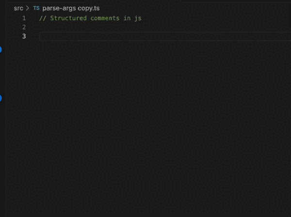

**Comment Hierarchy for VS Code**

Enhance your coding experience with Comment Hierarchy, a VS Code extension that automatically numbers your comment lines based on their nesting level, providing a clear and organized structure to your code annotations.

**Features:**



- **Automatic Numbering**: Automatically adds hierarchical numbering to your comments as you type.
- **Customizable Formats**: Choose from various numbering formats to match your coding style.
- **Multilanguage Support**: Works with multiple programming languages.
- **Toggle On/Off**: Easily toggle hierarchical comments on or off with a simple command.

**Usage:**

After installation, Comment Hierarchy will automatically number new comments. Use the command palette (`Ctrl+Shift+P`) and search for "Toggle Comment Hierarchy" to enable or disable the feature.

**Examples:**

Before:

```javascript
// # This is a top-level comment
// ## This is a nested comment
// ### This is a deeply nested comment
```

After:

```javascript
// 1 This is a top-level comment
// 1.1 This is a nested comment
// 1.1.1 This is a deeply nested comment
```

**Requirements:**

No additional requirements. Works out of the box with VS Code.

**Extension Settings:**

- `commentHierarchy.numberingStyle`: Choose your preferred numbering style.
- `commentHierarchy.enabled`: Enable or disable numbering by default.

**Known Issues:**

- Currently does not support block comments. See issue #10 on GitHub.

**Release Notes:**

For detailed release notes, check out the [CHANGELOG](https://github.com/wuchuheng/vscode-numerical-comment/CHANGELOG.md).

**Contributing:**

Contributions are welcome! Please see our [CONTRIBUTING](https://github.com/wuchuheng/vscode-numerical-comment/CONTRIBUTING.md) guide.

**License:**

Distributed under the MIT License. See [LICENSE](https://github.com/wuchuheng/vscode-numerical-comment/LICENSE) for more information.

---

Remember to replace URLs and specific details with your actual information. When your description is ready, you will include it in your extension's `package.json` under the `description` field and also as part of the `README.md`, which the VS Code Marketplace will render as the extension's detailed description page.
